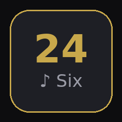

# 24Six — Home Assistant Add-on

Browse, search, and play 24Six Jewish music directly in Home Assistant, with full control over your WiiM speakers.



## Features

- Full 24Six library: songs, albums, artists, playlists, podcasts, videos, Torah content, live radio
- WiiM / LinkPlay speaker control via HA `media_player` entities
- **Multi-zone audio** — play different songs on different speakers simultaneously
- **Speaker grouping** — sync multiple WiiM speakers via LinkPlay with one click
- Zmanim (Jewish prayer times) with geolocation
- Brachos guide, Produce Checking (OU Kosher), Alarms
- Stories, Polls, Rewind
- Mobile-friendly with bottom navigation

## Installation

1. In Home Assistant go to **Settings → Add-ons → Add-on Store**
2. Click **⋮ → Repositories** and add:
   ```
   https://github.com/chanochsussman-lgtm/ha-addon-24six
   ```
3. Find **24Six** in the store and click **Install**
4. Click **Start**, then **Open Web UI**
5. Log in with your 24Six account credentials

## Configuration

No configuration required — all settings are handled through the in-app login screen.

The add-on uses your Home Assistant Supervisor token automatically to discover and control `media_player` entities.

## Speaker Control

### Single speaker
Open the speaker panel (🔊 button in the player bar) → **Output tab** → select a speaker.

### Grouped sync (same song, multiple speakers)
Speaker panel → **Groups tab** → select a leader → check members → **Sync Speakers**.
The main player automatically routes to the group leader.

### Independent zones (different songs per speaker)
Speaker panel → **Zones tab** → **Add Zone** → assign a speaker.
Switch the active zone to control different speakers independently.
Right-click any song → **Play on Zone** to send it to a specific zone.

## Requirements

- Home Assistant OS or Supervised installation
- 24Six account (https://24six.app)
- WiiM speakers added to HA via the WiiM or LinkPlay integration (for speaker control)
